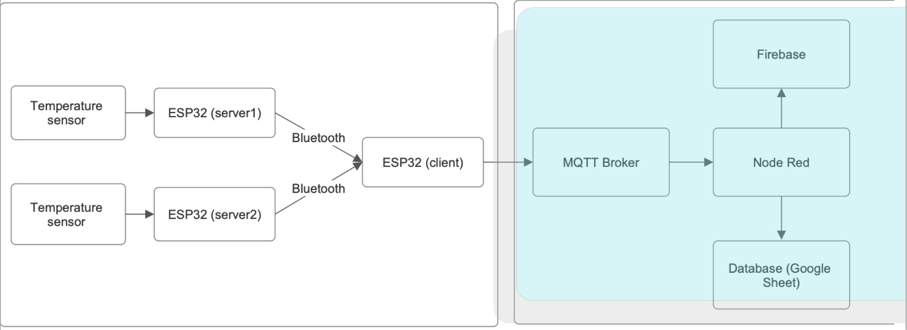
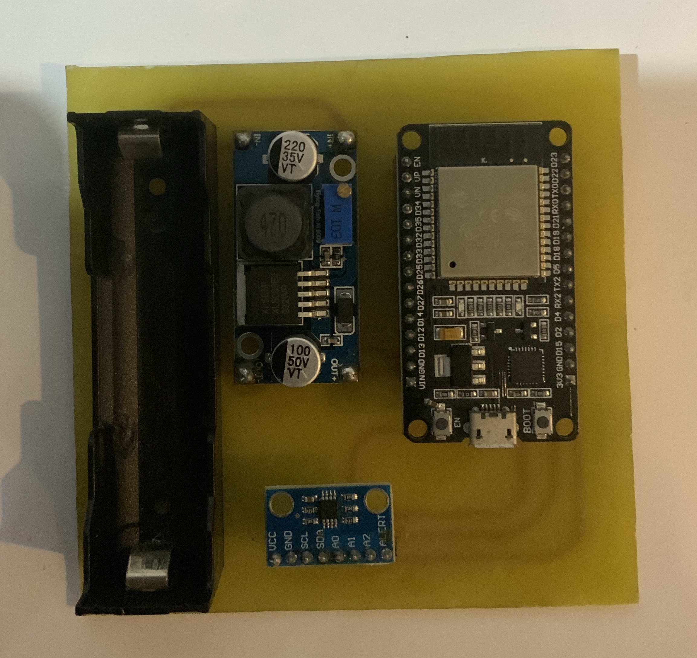

# Wireless Sensor System over BLE Network

## ระบบเซ็นเซอร์ไร้สายผ่านโครงข่าย BLE

**Authors:**
เอกราช จันทร์เคลือ
ชวพล ดวงพลอย

ภาควิชาวิศวกรรมอิเล็กทรอนิกส์
คณะวิศวกรรมศาสตร์
สถาบันเทคโนโลยีพระจอมเกล้าเจ้าคุณทหารลาดกระบัง (KMITL)
ถนนฉลองกรุง แขวงลำปลาทิว กรุงเทพมหานคร

---

# 📌 Project Overview

This project presents the design and implementation of a **Wireless Sensor System over BLE Network** using ESP32 and temperature sensors.

The system measures temperature data using MCP9808 and LM75 sensors, transmits data via BLE to an ESP32 client, and forwards it to an MQTT Broker. The data is then processed using Node-RED and displayed on a real-time Dashboard.

Additionally, the system stores data in:

* Google Sheets
* Firebase Realtime Database

---

# 🎯 Objectives

* Study BLE (Bluetooth Low Energy) communication
* Design a wireless temperature monitoring system
* Integrate BLE + WiFi + MQTT
* Build IoT dashboard using Node-RED
* Store cloud data using Google Sheets and Firebase

---

# 🧠 System Architecture

## 🔹 Block Diagram
<p align="center">
  
</p>

---

# 🔧 Hardware Components
<p align="center">
  
</p>

| Component                 | Description                                |
| ------------------------- | ------------------------------------------ |
| ESP32                     | WiFi + BLE Microcontroller                 |
| MCP9808                   | High accuracy temperature sensor (±0.25°C) |
| LM75A                     | I2C temperature sensor                     |
| XL6009                    | DC-DC Step-Up Converter                    |
| 18650 Lithium-Ion Battery | Power supply                               |
| Battery Holder            | 18650 holder                               |

---

## 📍 1. ESP32

ESP32 is a low-cost microcontroller with:

* Dual-core Tensilica Xtensa LX6
* WiFi
* Bluetooth & BLE
* Low power consumption

Manufactured by Espressif Systems.

---

## 📍 2. BLE Network

Bluetooth Low Energy (BLE):

* Operates at 2.4 GHz
* Designed for low power IoT devices
* Suitable for short-range communication (~10 meters tested)

Used for:

* Health devices
* IoT sensors
* Smart home systems

---

## 📍 3. MCP9808 Temperature Sensor

* Accuracy: ±0.25°C
* Range: -40°C to 125°C
* Supply voltage: 2.7V – 5.5V
* Communication: I2C

---

## 📍 4. LM75A Temperature Sensor

* Range: -25°C to 125°C
* I2C interface
* Low power mode
* Can connect up to 8 devices on same I2C bus (different addresses)

---

## 📍 5. XL6009 Step-Up Converter

* Input: 3V – 32V
* Output: 5V – 35V adjustable
* High efficiency
* Low ripple

---

## 📍 6. Lithium-Ion Battery (18650)

* Rechargeable
* Stable voltage output
* Long battery life
* Fast charging

---

# ⚙️ System Operation

## 1️⃣ BLE Communication

* ESP32 scans BLE devices
* Detects service UUID from MCP9808 / LM75
* Connects to sensor
* Registers notify callback
* Receives temperature updates

---

## 2️⃣ ESP32 to MQTT Broker

* ESP32 connects to WiFi
* Connects to MQTT Broker
* Publishes temperature data to:

```
temperature/mcp9808
temperature/lm75
```

---
<p align="center">
  
</p>

## 3️⃣ MQTT to Node-RED

Node-RED subscribes to:

```
temperature/mcp9808
temperature/lm75
```

Functions:

* Real-time Dashboard display
* Data logging
* Trigger-based automation

---

## 4️⃣ Node-RED Integration

Node-RED sends data to:

* Google Forms
* Google Sheets
* Firebase Realtime Database

---

# 📊 Experimental Results

## ✅ Performance

* Transmission range: ~10 meters
* Real-time dashboard update
* Data stored in Google Sheets
* Firebase live data monitoring

## 📈 System Capabilities

* Dual sensor monitoring
* BLE + WiFi hybrid communication
* Cloud data logging
* Realtime dashboard

---

# 🛠 PCB Design

* Separate PCB for MCP9808
* Separate PCB for LM75
* Custom layout designed and fabricated

---

# ❗ Challenges & Solutions

## Problem:

ESP32 memory limitation when using:

* BLE
* WiFi
* MQTT simultaneously

## Solution:

* Optimized memory usage
* Expanded available RAM settings in ESP32 configuration
* Reduced unnecessary libraries

---

# 📌 Conclusion

The system successfully:

* Collects temperature data from 2 sensors
* Transmits via BLE
* Sends to MQTT Broker
* Displays on Dashboard
* Logs to Google Sheets
* Updates Firebase in real-time

The project demonstrates practical IoT integration using BLE and cloud services.

---

# 🚀 Future Improvements

* Add more sensor types (humidity, pressure)
* Improve power efficiency
* Add mobile application
* Implement data encryption
* Expand BLE range using mesh networking

---
